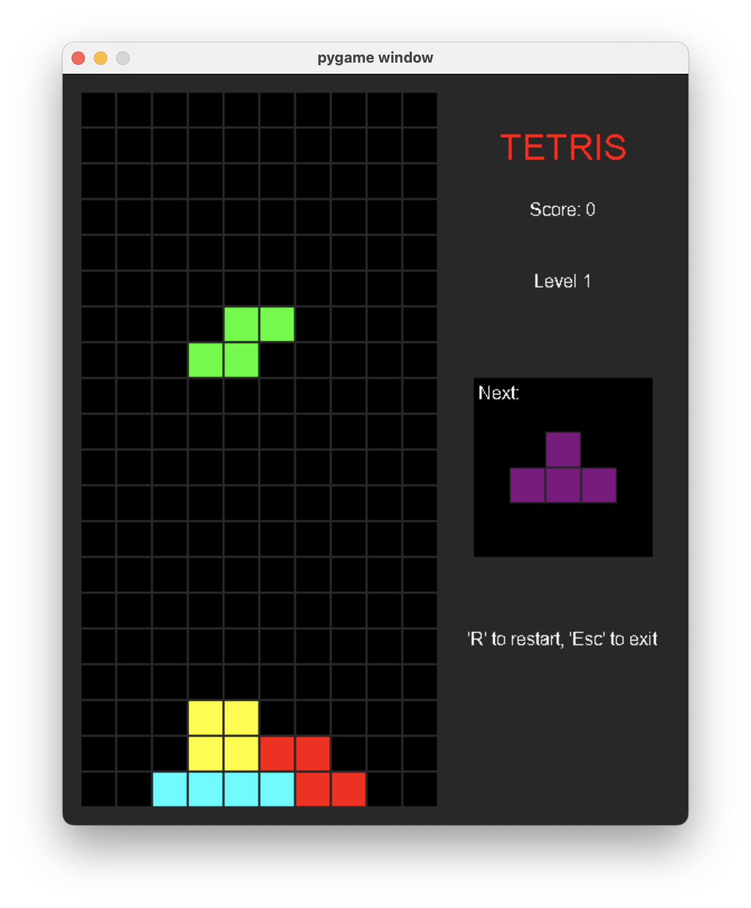
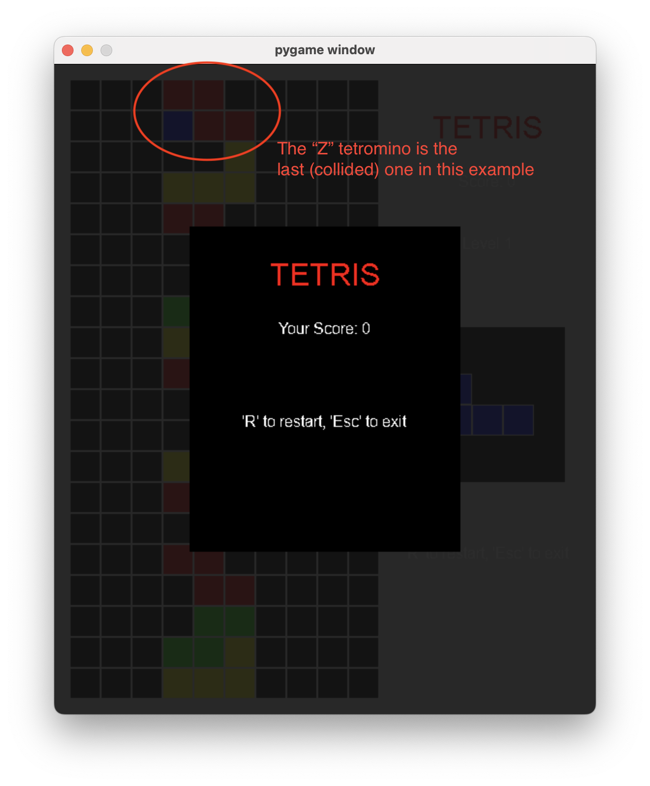

# TETRIS

Tetris game using Python and the pygame modules

## Control

This game follows the standard Tetris controls, use Left or Right key to shift the current tetromino horizontally, use Up key to rotate the current tetromino clockwise by 90 degrees, and use Down key to speed up the down fall

At anytime, player can press 'R' key on keyboard to restart the game, or press 'Esc' key to exit the game

## Scoring and Leveling

The Scoring system I used in this version took inspiration from different [scoring systems](https://tetris.wiki/Scoring), and it was designed in a way which encouranges players to clear multiple lines at once.

As for now, clearing 1, 2, 3, 4 lines will grant player 40, 100, 300, 1200 base points before any multipliers. Your final score earned per clearance would be equal to (base points * multiplier).

There are two multipliers, the level multiplier and Tetris multiplier. The level multiplier is equal to the current level; the game starts at level 1, and player will level up every time it clears 8 lines or more (counter reset when level up; currently max level is set to 10), and free fall speed will increase by 25 percents compare to the previous level. The Tetris multiplier is activated through previous Tetris clearance (clear 4 lines at once), and it will double the score earned for the next clearance when activated.

## Potential Improvements and TODOs

### Implementation and Code Design

There are some design/implementation decisions I made in this project that might be compromised, suboptimal or have room for improvements, and for some, I don't have a better solution at the moment; also, there are some nice-to-have features that I have in mind. Please see below:

- Handling of the speeding up of tetromino free fall after leveling up
  - I currently use a set_timer_flag and keep track of it in the game loop to signal the game to set new timer when level up to speed up the free fall, there might be a better way.
- Handling of the rendering of the last tetromino before game over
  - When game over, I want to show the last tetromino (the one which cause the game over), but at the same time, I don't want to keep updating the game board in the background (after game over) when the game over screen is shown, and therefore, in the gameloop, it keep track of a game_over flag to decide to update the game screen or the game over screen, but not both. However, in this way, the last tetromino will not be drawn. To tackle this problem, my current solution is using a last_frame_drawn variable along with the game_over flag, and only when both flags are true, the game loop will stop updating the game screen. I think there might be other ways to achieve the same goal, but I haven't been able to come up with a better solution.
  - 
- general code improvement, OOD, etc.
  - e.g. We can have the game logic in stay in the Tetris class while separate out the main game loop, rendering, etc.; the rendering logic can reside in its own class; ...
  - One problem that I haven't fully figured out is how to properly handle the free fall if we were to write the whole program in a more OOD fashion. I currently use a custum pygame timer event to implement the free fall, and the timer event is monitered in the game loop, so the shift down function is called from there. However, the periodical shift down (free fall) is part of the game logic, and thus, shouldn't be coupled with the game loop in my opinion.
- A mode which allows predefined sequence and gameboard. I think this would be nice to have feature as it is useful for testing and it could also acts like a puzzle solving mode.
- Game background
- Font and the clearness of the text

### Gameplay

- Press and hold Left, Right and Down key for continuous tetromino movement.
- Game level (and speed) currently cap at 10, could think of some more interesting way of leveling up (speed-up logic, level-up condition, scoring multiplier, etc.)
- Another idea I have is to implment some sort of dead/frozen lines appear under certain condition, unlock when Tetris or something. This would also work well with the leveling system.
- For tetromino generation, instead of purely by random, we can have some mechanism to make sure each type occur after certain number of tetrominoes (especially the "I" shape)
- [T-Spin](https://tetris.wiki/T-Spin) (I came across this concept while working on this project and I fould it quite interesting)
